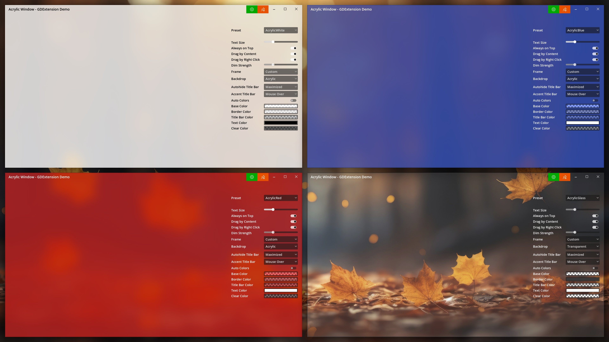

# Acrylic Window
Build modern applications with a custom frame and Acrylic & Mica styles in Godot.

## FEATURES

1. Fully customizable custom frame in GDScript.
2. Easily customizable built-in dark & white themes.
3. 5 backdrops: Solid, Transparent, Acrylic, Mica & Tabbed.
4. Aero Snap support.
5. Control roundness of window corners for Windows 11.
6. Autohide & Accent title bar (useful for OLED screens to prevent burn-in of the static elements and to maximize the working space).
7. Drag window by content & by right click (useful for apps like PureRef or video players).
8. Always on Top pin button (useful for debugging and to keep important windows on top of other windows).
9. Dim inactive window.

Please note: Acrylic, Mica & Tabbed backdrops require Windows 11 22H2.

## HOW TO USE

The easiest way is to download the latest release.

Just extract it and copy the `addons` folder to your project.  
Extend or reuse the `acrylic_main` scene to apply custom frame.  

Make sure to enable transparency: `Godot > Project > Project Settings > Display > Window > Transparent`

## HOW TO BUILD

If you want to build the extension by yourself then follow these steps:

1. Open the project folder in Visual Studio.
2. Select configuration `x64 Release`.
3. Let Visual Studio configure the project.
4. Select the Startup Item `AcrylicWindow.dll`.
5. Build the project.
6. Copy the contents of the `demo/addons` folder to your project.
7. Enable transparency: `Godot > Project > Project Settings > Display > Window > Transparent`

## HOW TO DEBUG

Please check this project for the detailed guide how to debug GDExtension: https://github.com/slyisdreaming/gdextension-cmake-template
