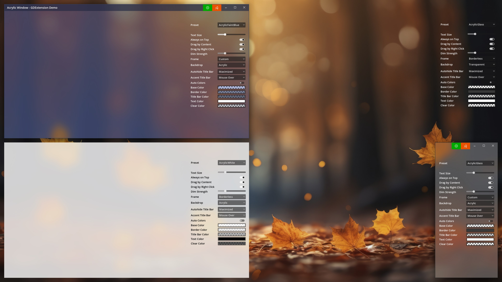

# Acrylic Window
This GDExtension brings Acrylic and Mica styles to apps made with Godot.

 

> Thanks to [vorlac](https://github.com/vorlac) for the detailed guide how to build GDExtensions with CMake.  
> Check his work here: https://github.com/vorlac/godot-gdextension-demo-cmake

You need Windows 11 22H2 or newer to enable Acrylic and Mica effects.

**To build this extension:**

1. Open the project folder in Visual Studio.
2. Select configuration `x64 Release`.
3. Let Visual Studio configure the project.
4. Select the Startup Item `AcrylicWindow.dll`.
5. Build the project.
6. Copy the contents of the `demo/bin` folder to your project.
7. Enable transparency: `Godot > Project > Project Settings > Display > Window > Transparent`

The extension will be built against the Godot 4.2 release and it should work just fine with Godot 4.3 but not 4.1. Edit `CMakeLists.txt` if you need a different version.

You can debug the extension with the released version of Godot or with the custom build. The latter helps trace bugs directly into the engine.

**To debug with the released version of Godot:**

1. Edit `.vs/launch.vs.json` file to point to a release installation of Godot.
2. Open the project folder in Visual Studio.
3. Select configuration `x64 Debug`.
4. Let Visual Studio configure the project.
5. Select the Startup Item `AcrylicWindow (Godot 4.2)`.
6. Build the project.

If everything worked correctly, the editor should automatically open the demo project.

To debug with the custom build of Godot, you need to build Godot first. Don't worry, that is easy and it takes just 5 minutes to build the entire engine.

**To build Godot:**

1. Install Python 3.
2. Run `x86_x64 Cross Tools Command Prompt for VS 2022` as administrator.
2. Install scons: `pip install scons`
3. Edit `.gitmodules` if you want to use a different branch of the engine. The current one is 4.2.
3. Initialize Godot submodule: `git submodule update --init`
4. Build Godot: `scons --directory=godot platform=windows target=editor arch=x86_64 debug_symbols=yes optimize=debug`

**To debug with the custom build:**

1. Open the project folder in Visual Studio.
2. Select configuration `x64 Debug`.
3. Let Visual Studio configure the project.
4. Select the Startup Item `AcrylicWindow (Custom 4.2)`.
5. Build the project.

Once again, if everything worked correctly then the editor should automatically open the demo project. And now you can debug not just the extension but the engine itself.

**To create a repository for GDExtension from scratch:**

1. mkdir myextension
2. cd myextension
3. git init
4. git submodule add -b 4.2 https://github.com/godotengine/godot
5. git config -f .gitmodules submodule.godot.shallow true
6. git submodule update --init
7. copy .vs, demo, src, .gitignore, CMakeLists.txt, CMakePresets.json, LICENSE, README.md
